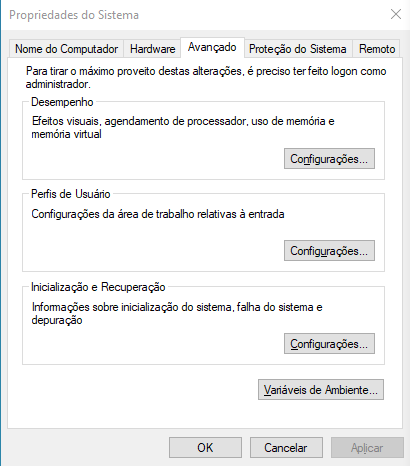
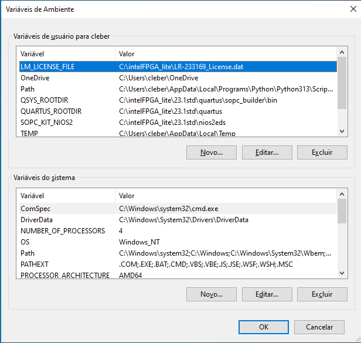

## 🛠️ Fixing Questa License Error After Installing Quartus Prime 23.1

This tutorial explains how to fix the license issue with **Questa Intel FPGA Edition** after installing **Quartus Prime 23.1**, where even with the license provided, Questa fails to launch or prevents HDL code simulation.

---

### 🔧 Problem

Even after adding the license file, Questa **does not start correctly**, making it impossible to simulate HDL projects.

---

### ✅ Solution

You need to manually add the environment variable `LM_LICENSE_FILE` in Windows, pointing to the location of the `.dat` license file.

---

### 📝 Step-by-Step Instructions

1. Open the **Control Panel**.
2. Go to **System** → click **Advanced system settings**.
3. In the **Advanced** tab, click **Environment Variables...**.

   

4. Under **System variables**, click **New...**.
5. Fill in the fields as follows:

   - **Variable name:** `LM_LICENSE_FILE`  
   - **Variable value:** Full path to the license `.dat` file.  
     Example:
     ```
     C:\intelFPGA\23.1\licenses\license.dat
     ```

   

6. Click **OK** to save and then **restart** your computer or terminal.

---

### ✅ Expected Result

After configuring the environment variable correctly, Questa should launch normally and allow HDL simulations.

---

### 📎 Related Resources

- [Download Quartus Prime 23.1](https://www.intel.com.br/content/www/br/pt/software-kit/795188/intel-quartus-prime-lite-edition-design-software-version-23-1-for-windows.html)
- [Intel FPGA official documentation](https://www.intel.com/content/www/us/en/products/details/fpga.html)

---

